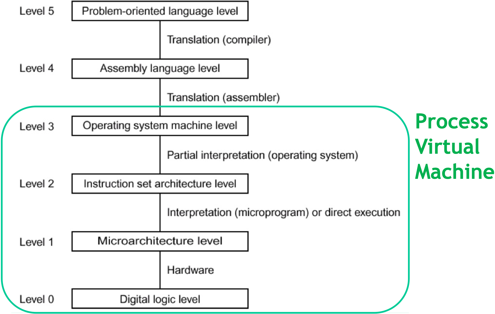

---

## Download as PDF

You can download this note as a PDF by clicking [here](virtualisation.pdf).

---

Cloud computing is implemented via virtualisation: hardware resources in a data centre are partitioned and shared among multiple **virtual machines** (VMs) which are monitored by the **virtual machine monitor** (VMM), that governs the access of the VMs to the physical resources of the servers. This grants great performance, isolation among VMs and security.

Let’s now dive deeper into the topic of virtual machines and virtualisation.

## Virtual machines from an architectural perspective

A machine is an execution environment capable of running a program. However, how do we understand the difference between a physical and a virtual machine?

In order to fully grasp this, we must go back to the computer architecture.

In a computer architecture, the set of instructions that a program can use might be structured at different levels:

We can further divide these levels between software and hardware:

### Instruction Set Architecture (ISA)

As we can see from the graph above, the Instruction Set Architecture marks the division between hardware and software.

The ISA can be further divided into two separate domains:

- **User ISA**: aspects of the ISA that are visible to an application program, such as arithmetic and logical operations or branches. When an application interacts with the hardware, the user ISA is used.
- **System ISA**: aspects visible to the supervisor software—the operating system for example—which is responsible for managing hardware resources, like hiding the complexities of CPUs, defining how applications access memory, and more. When the OS interacts with the Hardware—through drivers, the scheduler or memory management—the system ISA is used.

### Application Binary Interface (ABI)

The Application Binary Interface corresponds to level 3 in the layered execution model we have seen earlier. It provides a program the hardware resources and the available system services via the operating system.

The ABI provides the binary with **system calls**, which allow programs to interact with shared hardware resources indirectly via the OS.

---

## Machine virtualisation

A **Virtual Machine** (VM) is a logical abstraction able to provide a virtualised execution environment. More specifically, a VM:

- Provides identical software behaviour
- Consists in a combination of physical machine and virtualising software
- May appear to have different resources with respect to the ones found in the physical machine
- May result in a different level of performance

The tasks that a VM must accomplish are:

- Mapping virtual resources or states to the corresponding physical ones
- Using physical machine instructions and calls to execute the virtual ones

There are two main types of virtual machines: system VMs and process VMs.

### System VMs

A system virtual machine provides a virtualisation software—called Virtual Machine Monitor—that supports levels 0-2 of the architecture:

System VMs provide a complete system environment that can support an operating system with potentially many user processes.

The Virtual Machine Monitor is placed between hardware and software directly and it emulates the ISA interface that the software sees:

A VMM can provide its functionality either working directly on the hardware or running on another OS:

### Process VMs

A process virtual machine also supports level 3 of the architecture:

A process VM is able to support an individual process and the virtualising software—usually called **runtime software**—is places at the [ABI](#Application%20Binary%20Interface%20(ABI)) interface, on top of the OS/hardware combination:

The runtime software emulates both user-level instructions and operating system calls.

### Guest and host terminology

When talking about virtual machines, we usually refer to the underlying platform supporting the system as the **host**, while we refer to the software that runs inside the VM as the **guest**.

### Types of virtualisation

There are different kinds of virtualisation, which depend on the type of VM used and the ABI and ISA provided by the system and the VMM:

#### Multiprogrammed system

A very common approach of all modern operating systems for multi-user support is to create a virtual machine formed by the OS’s call interface and the user ISA. This way, every user process is given both the illusion of having a complete machine to itself and its own address space.

Given that this is only possible where guest and host both run on the same ABI and OS, it is arguable whether this is a real virtualisation mechanism.

#### Emulation

Emulation refers to software technologies developed to allow an application or OS to run in an environment different from what was originally intended.

Emulation is requires when the VMs have a different ABI or ISA from the architecture where they are running on. Very common examples of this are console emulators.

##### High-Level Language VM

The goal of a High-Level Language (HLL) VM is to have an isolated execution environment **for each application** (or for different instances of the same application).

In this context, the VM must translate application byte code to OS-specific code (different ABI) and minimise hardware- or OS-specific features for platform independence.

With this type of virtualisation, applications can run in a sandboxed way, so that they are not conflicting with one another and are not “installed” on the system in a more traditional way. Furthermore, this lets applications migrate more easily from one platform to another.

The greatest example of HLL VM is the Java Virtual Machine.

#### Classic-System VM

A Classic-System VM is a system virtual machine that runs software for the same ISA as the underlying one. In this case, we distinguish between system VMs and hosted VMs:

- System VMs have a virtual machine monitor running on bare hardware
- Hosted VMs have a virtual machine monitor that runs on top of a host operating system

In system VMs, the VMM can intercept the guest OS’s interaction with hardware resources and translate them to fulfil its requests, which makes it the most efficient VM architecture available. Furthermore, system VMs allow to run multiple OSs on the same hardware.

##### Virtual Machine Managers

A Virtual Machine Manager is an application that:

- Manages the virtual machines
- Mediates access to the hardware resources on the physical host system
- Intercepts and handles any privileged or protected instructions issued by the virtual machines

Many times, the following terms refer to the same thing:

- Virtual Machine Manager
- Virtual Machine Monitor
- Hypervisor

However, some authors give slightly different meanings to them:

| Term                    | Description                                                                                   |
| ----------------------- | --------------------------------------------------------------------------------------------- |
| Virtual Machine Manager | A VMM or hypervisor that is also used to create, configure and maintain virtualised resources |
| Virtual Machine Monitor | The virtualisation software                                                                   |
| Hypervisor              | A virtualisation software that runs directly on the hardware                                  |

There are two main types of VMMs:

- **Type 1** hypervisors (also called **bare-metal** hypervisors) take direct control of the hardware of the machine they run on
  
- **Type 2** hypervisors (also called **hosted** hypervisors or VMMs) reside within a host OS
  

###### Type 1 hypervisor architectures

Type 1 hypervisors are usually built following two types of architecture: **monolithic** and **microkernel**.

In a monolithic architecture hypervisor, device drivers run within the hypervisor, granting better performance and isolation, but also restricting the usable hardware to one that the hypervisor has drivers for.

In a microkernel architecture hypervisor, instead, device drivers run within a service VM, shrinking the size of the hypervisor and leveraging the driver ecosystem of an existing operating system. Furthermore, microkernel hypervisors can use third-party drivers—although it may be more difficult to do so.

###### Type 2 hypervisor architectures

Type 2 hypervisors always have at least two operating systems running on the same hardware:

- The **host** operating system, which controls the hardware
- The **guest** operating system, which runs inside the virtual machine

The Virtual Machine Manager runs on the host OS, while applications run in the guest OS.

Having a host OS managing the hardware makes running a VMM more flexible in terms of underlying hardware and simpler to manage and configure. However, special care must be taken to avoid conflicts between host and guest OSs. Finally, the host OS may consume a non-negligible set of physical resources, making the guest OS’s performance worse.

#### Whole-System VM

When it is required to run software or OSs that are built to run on a different ISA than the one on the system we intend it to run on, both application and OS code require emulation. This is done via whole-system VMs, which usually implement the VMM and guest software on top of a conventional host OS running on the hardware.

---

## Virtualisation implementations

Given a typical layered architecture of a system, virtualisation is implemented by adding some **virtualisation layers** between execution stacks. Depending on where the new layer is placed, we obtain different types of virtualisation.

### Hardware-level virtualisation

Hardware-level virtualisation is obtained by placing the virtualisation layer between hardware and operating system.

In this case, the interface seen by the operating system and other applications may be different from the physical one.

### Application-level virtualisation

Application-level virtualisation is obtained by placing the virtualisation layer between the operating system and application software. One such example is the Java Virtual Machine.

With this type of virtualisation, applications run in their environment independently from the operating system.

### System-level virtualisation

System-level virtualisation is obtained by placing the virtualisation layer between the operating system and one or more guest OSs. The layer provides the interface of a physical machine to the OSs and to the applications running on them. Some examples of this type of virtualisation are offered by virtualisation software such as VMWare Player or VirtualBox.

#### Virtualisation techniques

In order to implement system-level virtualisation—assuming VM and system must run on the same ISA—two main techniques are implemented: **paravirtualisation** and **full virtualisation**.

##### Paravirtualisation

In paravirtualisation, guest operating system and virtual machine manager collaborate: the VMM presents an interface that is similar—albeit not identical—to the one on the underlying hardware to the running VMs. This makes it possible to reduce the guest’s execution of tasks that may be too expensive for the virtualised environment. In fact, thanks to **hooks** that call host OS primitives translated from guest OS primitives, some actions execute much quicker than if the VM had to virtualise and execute them as well.

This makes it for a simpler VMM and higher performance at the cost of a modified guest operating system: paravirtualisation cannot be used with traditional OSs.

##### Full virtualisation

Full virtualisation, in contrast to paravirtualisation, provides a complete simulation of the underlying hardware: the full instruction set, I/O operations, interrupts and memory accesses are all virtualised. Some protected instructions are still trapped and handled by the hypervisor however.

This makes it possible to run the hypervisor on any unmodified OS, but the need for hypervisor mediation—in order to allow the execution of tasks that would be too costly in the virtual domain—and some architecture requirements make it less performant than paravirtualisation.

##### Paravirtualisation vs. full virtualisation

Below, an effective summary of the differences between paravirtualisation and full virtualisation.

---

## Properties of virtualisation

Virtualisation brings forth some properties that make it very successful in today’s cloud-computing-centred infrastructures:

- **Partitioning**: multiple OSs can be executed on a single physical machine, with different partitioning of resources between different VMs
- **Isolation**: a fail in a VM does not compromise the hardware, providing fault tolerance and security; furthermore, advanced resource control techniques can be used to guarantee a certain level of performance
- **Encapsulation**: the entire state of VMs can be saved in a file, which makes stopping, restarting and migrating VMs very easy
- **Hardware independence**: given that a VM can work independently of the hardware beneath it, provisioning and migration of VMs on servers is simple

---

## Containers

Containers are preconfigured packages which contain all possible dependencies needed to execute code in a target machine.

The main advantage of containers is that their behaviour is **predictable**, **repeatable** and **immutable**: containers always behave in the same way regardless of underlying hardware, which makes them extremely useful for application deployment.

The main difference with virtual machines is that while VMs provide hardware virtualisation, containers provide virtualisation at the operating system level; furthermore, containers share the host system kernel with other containers.

The main benefits of containers is that they are:

- **Flexible**: even the most complex applications can be containerised
- **Lightweight**: the containers exploit and share the host kernel
- **Interchangeable**: updates can be distributed on the fly
- **Portable**: containers can be created locally, deployed to the cloud and ran anywhere
- **Scalable**: it’s possible to automatically distribute replicas of a container to support increased traffic
- **Stackable**: containers can be stacked vertically on the fly

Containers ease the deployment of application and increase their scalability, but they also impose a modular application development where the modules are independent and uncoupled.

Containers can be used to:

- Help make your local development and build workflow faster, more efficient and lightweight
- Running standalone services and applications consistently across multiple environments
- Creating isolated test instances
- Building and testing complex applications and architectures on a local host before deployment
- Building a multi-user Platform-as-a-Service (PaaS) infrastructure
- Providing a lightweight standalone sandbox environment
- Creating and executing Software-as-a-Service (SaaS) applications

The most popular software for container generation and execution is Docker, coupled with the widely-adopted orchestration service Kubernetes.
