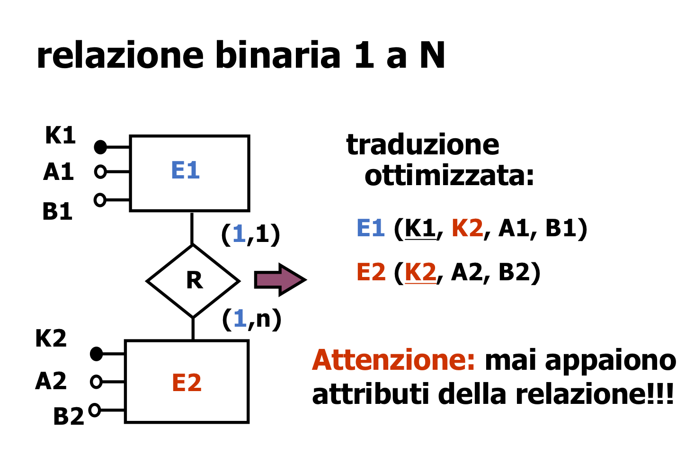
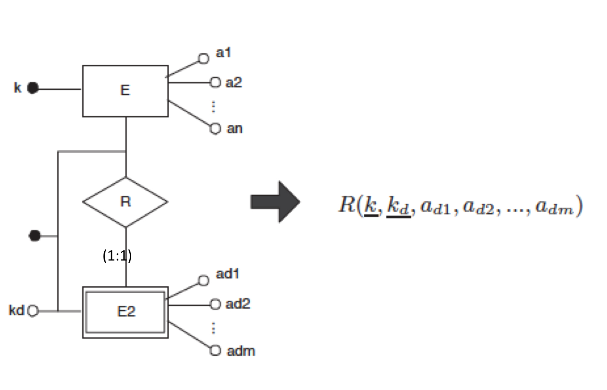

---

## DBMS e File System

Un DBMS:

- Permette di accedere in modo efficiente ai dati con una granularità più fine che il file system
- Permette di accedere in modo diretto ai dati basandosi sulle loro proprietà
- Effettua il controllo della concorrenza alla granularità del singolo record
- Realizza meccanismi sofisticati per il controllo dell'affidabilità
- Realizza meccanismi di controllo della privatezza
- Realizza l'atomicità delle transazioni

## Espressività dei linguaggi formali

Il Datalog può essere più espressivo dell'algebra relazionale e del calcolo delle tuple quando implementa **query ricorsive**.

## Proprietà ACID

I DBMS transazionali assicurano le proprietà ACID, cioè:

- **Atomicità** (*Atomicity*): una transazione è un'unità indivisibile di esecuzione 
- **Correttezza** (*Consistency*): una transazione porta la base di dati da uno stato valido ad un altro stato valido, ossia una transazione non viola i vincoli di integrità imposti nel database
- **Isolamento** (*Isolation*): l'esecuzione di più transazioni concorrenti lascia il database nello stesso stato in cui sarebbe giunto se le transazioni fossero state sequenziali
- **Durabilità** (*Durability*): una volta che una transazione è andata a buon fine, i cambiamenti che essa apporta sono permanenti

---

## Normalizzazione di una base di dati

Normalizzare un database significa *organizzare* i dati in esso contenuto in modo da ridurre la ridondanza e migliorare l'integrità dei dati.

In un database normalizzato, tutti i dati sono suddivisi in tabelle diverse, ognuna delle quali contiene dati su un argomento specifico. Ogni tabella ha una chiave primaria e le altre tabelle usano questa chiave per fare riferimenti ai dati nella tabella principale.

Le forme normali più utilizzate sono:

- **Prima Forma Normale** (1NF): ogni casella in una tabella deve contenere un singolo valore ed ogni colonna deve avere un nome unico
- **Seconda Forma Normale** (2NF): tutte le colonne che non sono chiavi primarie devono dipendere dalla chiave primaria
- **Terza Forma Normale** (3NF): nessuna colonna che non è di chiave primaria deve dipendere da una colonna che a sua volta non è di chiave primaria in una tabella

La normalizzazione migliora la performance delle query, riduce la ridondanza dei dati e rende il database più flessibile ai cambiamenti.

Da ChatGPT:

> In the context of database normalization, "Functional dependency" (FD) is a relationship between two attributes in a table, where the value of one attribute determines the value of another attribute.
> First Normal Form (1NF) can be redefined as a table where all attributes are atomic and there are no repeating groups. Additionally, all non-key attributes are functionally dependent on the primary key, meaning that the value of the primary key determines the value of each non-key attribute.
> Third Normal Form (3NF) can be redefined as a table that is already in 1NF and all non-key attributes are non-transitively dependent on the primary key, meaning that any non-key attribute does not functionally depend on any other non-key attribute.
> To put it simply, 1NF is a requirement that ensures that a table has no repeating groups and that all non-key attributes are functionally dependent on the primary key. And 3NF is a requirement that ensures that a table is already in 1NF and that non-key attributes are non-transitively dependent on the primary key.
> So, to achieve 3NF, first, we need to make sure that the table is in 1NF, which means no repeating groups and all non-key attributes are functionally dependent on the primary key. And then, we need to make sure that non-key attributes are non-transitively dependent on the primary key. This is done by removing transitive dependency on non-key attributes.

### Definizioni di 3NF usate in classe

> Una relazione è in terza forma normale se, per ogni dipendenza funzionale $X\to Y$ definita su di essa, almeno una delle seguenti condizioni è verificata: $X$ contiene una chiave della relazione oppure $Y$ è contenuta in almeno una chiave della relazione

> Una relazione è in terza forma normale se è in seconda forma normale e non contiene dipendenze transitive dalla chiave, cioè tutti gli attributi non-chiave dipendono direttamente dalla chiave

---

## Fasi del progetto logico

Il progetto logico consiste nella traduzione dello schema concettuale E/R e delle relazioni in schemi di tabelle ed è composto dalle seguenti fasi:

1. Eliminazione delle gerarchie Is A
2. Normalizzazione degli attributi composti o multipli
3. Traduzione delle entità forti e delle relazioni in schemi relazionali
4. Traduzione delle entità deboli

### Traduzioni standard

- Ogni entità è tradotta in una tabella con gli stessi attributi
- Ogni relazione è tradotta in una tabella con gli stessi attributi, cui si aggiungono gli identificatori di tutte le entità che essa collega
- È possibile ottimizzare la traduzione delle relazioni che sono, almeno da un lato, di cardinalità $1:1$, aggiungendo la chiave primaria dell'entità dall'altra parte della relazione tra gli attributi della prima entità (notare che questo è possibile soltanto nel caso di relazioni senza attributi)

- Le gerarchie possono essere ridotte alle sottoclassi (solo quando la gerarchia è **totale ed esclusiva**) o alla superclasse (aggiungendo un identificatore che specifica a quale sottoclasse l'entità appartenga; va notato che in questo caso, alcuni attributi diventano opzionali)
- Le entità deboli vengono fuse con la relazione che le unisce ad un'entità forte

