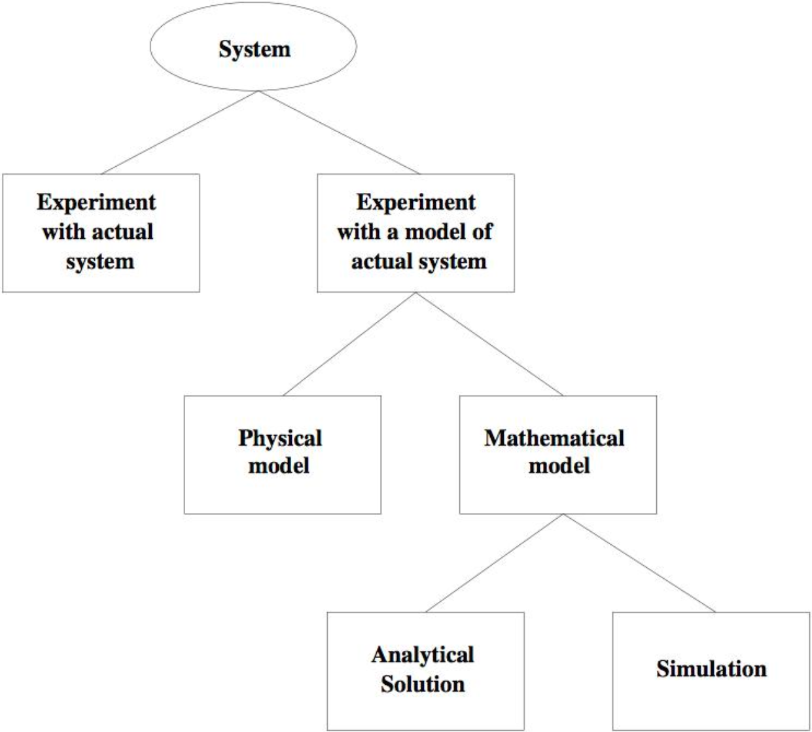

---

## Download as PDF

You can download this note as a PDF by clicking [here](simulation.pdf).

---

## Ways to study a system

There are multiple ways to study a complex system:



## Network emulation

In between experimenting with an actual system and using a model of the system, we can use the system on a "simulated" environment, which addresses the difficulty of testing distributed systems in large scale, complex deployments.

Emulation differs from simulation in that a network emulator appears to be a network to the OS.

Network emulation can be accomplished by introducing a component or device that alters the packet flow in a way that imitates the behaviour of the environment being simulated, for example a WAN or a wireless network.

Network emulation is usually coupled with a node emulation software, i.e. a virtual machine.

In practice, network emulation is usually done through [Mininet](http://mininet.org/), [FreeBSD Dummynet](https://man.freebsd.org/cgi/man.cgi?dummynet) or [Linux NetEm](https://man7.org/linux/man-pages/man8/tc-netem.8.html).

## Analysing before building

It is often important to analyse a system before building it. This, of course, requires a model of the given system, and there are many types of those:

- Analytical vs. operational
- Discrete vs. continuous
- Deterministic vs. stochastic

Simulation is but a special form of analysis in which the history of a system execution is obtained and analysed.

### Discrete event simulation

Discrete event simulation is a simple method to analyse the performance of a system using a discrete, deterministic, operational model. It involves different elements:

- A list of events (which are timestamped objects)
- A simulation clock
- A set of state variables and performance indicators
- An event processing function

A discrete event simulation works by repeating these three steps forever:

1. Get the first event from the list and remove it from the list
2. Advance the clock to the timestamp of that event
3. Pass the event to the event processing function

These three steps are done via a **discrete event simulator**. It usually makes simulation easier by providing a library of basic, general purpose elements, like random number generators, and a library of already existing models, such as hosts, routers, switches, and more.

Some examples of discrete event simulators are:

- [OpNet](https://opnetprojects.com/opnet-network-simulator/)
- [QualNet](https://www.keysight.com/us/en/assets/3122-1395/technical-overviews/QualNet-Network-Simulator.pdf)
- [JiST/Swans](http://jist.ece.cornell.edu/)
- [Parsec/Glomosim](https://en.wikipedia.org/wiki/GloMoSim)
- [J-Sim](https://www.kiv.zcu.cz/j-sim/)
- [Ns2](https://www.isi.edu/nsnam/ns/)
- [OMNeT++](https://omnetpp.org/)

#### OMNeT++

OMNeT++ is an event simulator that has been widely adopted to simulate distributed systems and networks. It provides:

- A component model to easily and effectively structure complex simulations through reusable components
- A C++ class library, including the simulation kernel and utility classes to build such components
- An infrastructure to assemble simulations from these components and configure them
- Runtime environments for simulations
- An Eclipse-based simulation IDE for designing, running and evaluating simulations

Separately, several simulation frameworks have ben developed, which include OMNeT++ components to simulate distributed systems, such as:

- [INET](https://www.inetsim.org/)
- [Mobility Framework](https://omnetpp.org/download-items/MobilityFramework4.html)
- [Mixim](https://omnetpp.org/download-items/MiXiM.html)
- [Castalia](https://omnetpp.org/download-items/Castalia.html)

##### The OMNeT++ component model

Let's now analyse OMNeT++ modules in depth.

OMNeT++ has two types of modules: **simple** modules and **compound** modules.

Each module has **gates** through which messages can be sent to other modules. Modules are connected together to build a **hierarchy** of modules. The NED language defines modules and wiring.

For simple modules, the NED definition just introduces the interface, while the implementation is given in C++.

Modules have parameters whose values can be given into the `omnetpp.ini` file and change at each run.

In OMNeT++, the entire simulation is just an **instance of the highest level module**.

Below is an example of a simple module defined via NED:

```ned
// Ethernet CSMA/CD MAC

simple EtherMAC {
	parameters:
		string address; // Others omitted for brevity
	gates:
		input phyIn;    // To physical layer
		output phyOut;  
		input llcIn;    // To EtherLLC or higher layer
		output llcOut;
}
```

Now let's look at an example of a compound module:

```ned
// Host with an Ethernet interface

module EtherStation {
	parameters:   // Omitted
	
	gates:
		input in; // To connect to switches and hubs
		output out;
		
	submodules:
		app: EtherTrafficGen;
		llc: EtherLLC;
		mac: EtherMAC;
		
	connections:
		app.in     <-- llc.hlOut;
		app.out    --> llc.hlIn;
		llc.macIn  <-- mac.llcOut;
		llc.macOut --> mac.llcIn;
		mac.phyIn  <-- in;
		mac.phyOut --> out;
}
```

##### Implementing simple modules

For each simple module, the developer needs to write a C++ class with the module's name, which extends the library class `cSimpleModule`. Several methods of this class can be redefined. The main ones are:

- `initialize()`
- `finish()`
- `handleMessage(cMessage *msg)`

The developer also has to register the class via the `Define_module(module_name)` macro.

NED parameters can be read using the `par(const char *paramName)` method.

Finally, the developer can send messages to other connected modules using the `send(cMessage *msg, char *outGateName)` method.

##### Message classes

Message classes are subclasses of the `cMessage` library class which can be defined using a special language:

```
message NetworkPacket {
	fields:
		int srcAddr;
		int destAddr;
}
```

##### Collecting results

The simulation results are recorded into an output vector (`.vec`) and an output scalar (`.sca`) files. Output vectors capture the behaviour of the system over time, while the output scalar file contains summary statistics, like the number of packets sent.

The OMNeT++ library also includes classes to record statistics and organise them, like `cLongHistogram`.

##### Random numbers

In simulations, it is often required to generate data randomly. OMNeT++ provides a configurable number of RNG instances which can be freely mapped to individual simple modules in `omnetpp.ini`.

This means that the developer can set up a simulation model so that all traffic generators use global stream 0, all MACs use global stream 1 for backoff calculation and physical layers use global stream 2 and 3 for radio channel modelling.

These streams can also be seeded manually in the `.ini` file.

Non-constant module parameters can be assigned random variates like `exponential(0.2)`, which means that the C++ code will get a different number each time it reads the parameter.

