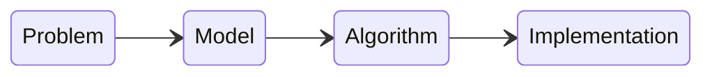

---

## Download as PDF

You can download this note as a PDF by clicking [here](intro.pdf).

---

## What is Operations Research?

Operations Research is a branch of applied mathematics in which mathematical models and quantitative methods are use to analyse complex decision-making problems and find near-optimal solutions.

> The overall goal of Operations Research is to help make better decisions

## What are decision-making problems?

Decision-making problems are problems in which we must choose a feasible solution among a large number of alternatives based on one or several criteria. Some examples are:

- Assignment problem
- Network design
- Shortest paths
- Personnel scheduling
- Service management
- Multicriteria problem

These complex problems are tacked via a **mathematical modelling approach**.

### Example: assignment problem

Given $m$ jobs and $m$ machines, suppose that each job can be executed by any machine and that $t_{ij}$ is the execution time of job $J_i$ on machine $M_j$.

|       | $M_1$ | $M_2$ | $M_3$ |
| ----- | ----- | ----- | ----- |
| $J_1$ | 2     | 6     | 3     |
| $J_2$ | 8     | 4     | 9     |
| $J_3$ | 5     | 7     | 8      |

Decide which job to assign to each machine so as to minimise the total execution time.

Each job must be assigned to exactly one machine and each machine to exactly one job.

The number of feasible solutions is $m!$.

### Example: network design

Decide how to connect $n$ cities via a collection of possible links so as to minimise the total link cost.

Given a graph $G=(N,E)$ with a node $i\in N$ for each city and an edge $\{i,j\}\in E$ of cost $c_{ij}$ for each link, select a subset of edges of minimum total cost, guaranteeing that all pairs of nodes are connected.

The number of alternative solutions is at most $2^m$, where $m = |E|$.

### Example: shortest path

Given a direct graph that represents a road network with distances for each arc, determine the shortest path between two points.

### Example: personnel scheduling

Determine the week schedule for the hospital personnel so as to minimise the number of people involved while meeting the daily requirements.

### Example: service management

Determine how many counters to open at a given time of the day so that the average customer waiting time does not exceed a certain value.

### Example: multicriteria problem

Decide which laptop to buy considering the price, the weight and the performance.

## Scheme of an Operations Research study

The main steps to resolve an Operations Research problem are:

1. Define the problem
2. Build the model for it
3. Select or develop an appropriate algorithm to solve it
4. Implement or use an efficient computer program to find a solution
5. Analyse the results

## Solving decision-making problems

A decision-making problem depends on many variables, like:

- The number of decision makers
- The number of objectives
- The level of uncertainty in the parameters

You may think of each one of these three features as a **dimension of an abstract coordinate system**.

Depending on the value of these dimensions, different methods are used to solve the problems:

- If there is one decision maker and one objective, **mathematical programming** is applied to the problem
- If there is one decision maker but several objectives to reach, **multi-objective programming** is used
- If the uncertainty level is not null, then **stochastic programming** can be helpful
- If there are several decision makers, then **game theory** is useful

### Mathematical programming

Mathematical programming is used to solve decision-making problems with a **single decision maker** and a **single objective**. They can generally be reduced to the following formula:

$$\min f(x), \text{ with } x\in X$$

> **Note**
>
> It is obvious that:
> $$\max\{f(x):x\in X\} = -\min\{f(x):x\in X\}$$

In mathematical programming, we define as:

- **Decision variables** $x\in\mathbb R^n$ the numerical variables whose values identify a solution to the problem
- **Feasible region** $X\subseteq\mathbb R^n$ the subset of the domain of the problem in which feasible solutions are found
- **Objective function** $f:X\to \mathbb R$ the function which expresses in quantitative terms the value or cost of each feasible solution

Solving a mathematical programming problem consists in finding a **global minimum**, i.e. a vector $x^*\in X$, such that:

$$f(x^*) \le f(x), \ \forall x \in X$$

It might also happen that the problem:

- Is infeasible: $X=\emptyset$
- Is unbounded: $\forall c \in \mathbb R, \exists x_c \in X$ such that $f(x_c)\le c \lor f(x_c)\ge c$
- Has a single optimal solution
- Has a large (possibly infinite) number of optimal solutions

When the problem is very difficult to solve, we must settle for a feasible solution that is a **local minimum**, i.e. a vector $\hat x\in X$, such that:

$$f(\hat x)\le f(x), \ \forall x\in X \text{ with } ||x-\hat x||\le \epsilon$$

for an appropriate value $\epsilon>0$.

It must be noted that an optimisation problem may have many local optima.

#### Special cases of mathematical programming

There are many different types of mathematical programming:

| Type of programming        | Description                                                                                                                                                      | Use case                              |
| -------------------------- | ---------------------------------------------------------------------------------------------------------------------------------------------------------------- | ------------------------------------- |
| Linear Programming         | $$f \text{ is linear and } X = \bigg\{x\in\mathbb R^n:g_i(x) \lesseqgtr 0, i = 1,\ldots,m \bigg\} \text{ with } g_i \text{ linear } \forall i$$                  | Production planning                   |
| Integer Linear Programming | $$f \text{ is linear and } X = \bigg\{x\in\mathbb R^n:g_i(x) \lesseqgtr 0, i = 1,\ldots,m \bigg\} \cap \mathbb Z^n \text{ with } g_i \text{ linear } \forall i$$ | Portfolio selection                   |
| Nonlinear Programming      | $$f \text{ convex/concave and } X = \bigg\{x\in\mathbb R^n:g_i(x) \lesseqgtr 0, i = 1,\ldots,m \bigg\} \text{ with } g_i \text{ convex/concave } \forall i$$     | Facility location (with $g_i$ convex) | 

### Multi-objective programming

When decision-making problems have one single decision maker but **many different objectives**, multi-objective programming is used to solve them.

Multiple objectives can be taken into account in different ways. Suppose we wish to minimise $f_1(x)$ and maximise $f_2(x)$. Considering the laptop example from earlier, $f_1$ could be cost and $f_2$ could be performance. We can do the following:

1. Turn the problem into a single objective problem by expressing the two objective in terms of the same unit:$$\min \lambda_1f_1(x) - \lambda_2f_2(x)$$
2. Optimise the primary objective function and turn the other objective into a constraint:$$\max_{x\in\tilde{X}} f_2(x), \ \tilde X = \{x\in X:f_1(x)\le c\}$$

## Mathematical programming vs. simulation

Both mathematical programming and simulation involve constructing a model and designing an algorithm, but there are some differences between the two:

| Mathematical programming           | Simulation                                                                                                          |
| ---------------------------------- | ------------------------------------------------------------------------------------------------------------------- |
| Problems can be well formalised    | Problems are difficult to formalise                                                                                 |
| Algorithms yield optimal solutions | Algorithm simulates the evolution of the real system, allowing to evaluate the performance of alternative solutions |
| The results are certain            | The results need to be interpreted                                                                                  |
